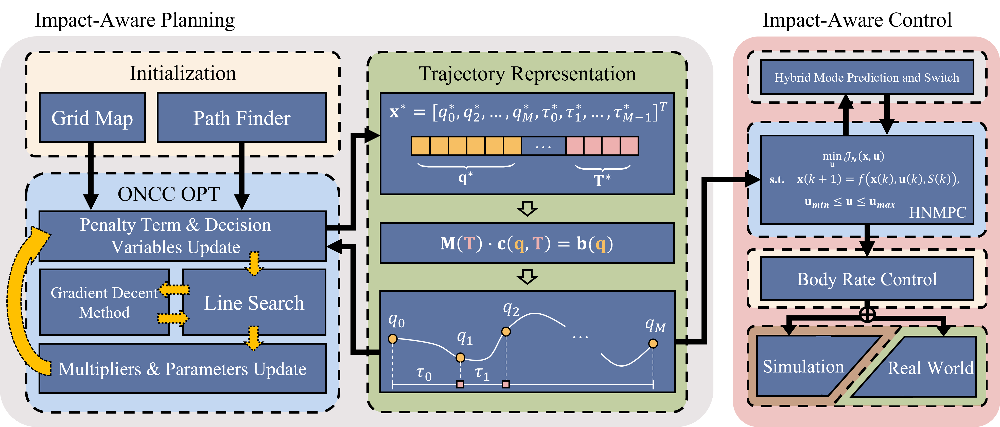

# My Adaptation
under ~/impactor_ws

所需修改内容：
- 计算时间
- 修改路径点，过点半径rrR
  - 路径点可由payload_manager.yaml中waypoints定义修改
  - 门半径、可飞行区域由scenario1.yaml定义
  - 无过点半径概念，生成的是时序轨迹
- 修改飞机、负载质量，绳长
  - payload_manager.yaml:改无人机物理配置
- 修改输入上下限
  - 规划阶段：payload_opt.yaml
  - 控制阶段：mpc_onboard.yaml, mpc_sim.yaml, mpc.yaml
- 无人机、负载全状态
  - /visualizer下子topic中可读

## Notes
- 问题记录
  - `(impactor) stark@Winterfell:~/impactor_ws$ rostopic echo /planning/trajectory_info
  ERROR: Cannot load message class for [impact_plan/PolynomialTraj]. Are your messages built?
`
    - 自定义消息类型需`source devel/setup.bash`

- run with rviz
  - `roslaunch impact_plan impactor.launch`

- impactor.launch: 启动rviz + 运行env_generator节点 + （默认）启动payload_plan.launch
- payload_plan.launch: 
  - 启动impact_plan_node，包含src/manager/global_plan.cpp, planner_manager.cpp, plan_node.cpp
  - 启动trajectory_server，src/manager/traj_server.cpp
  - 启动simulator.xml
- simulator.xml: 
  - 启动so3_quadrotor仿真无人机
  - 启动odom_visualization在rviz中绘制可视化轨迹
  - 启动pcl_render_node，模拟机载深度摄像头
  - （启动mpc_controller_node，使用mpc控制器）

### 规划部分
- impact_plan_node
  - plan_node.cpp （启动器）: 初始化impact_plan_node，创建 GlobalPlanner 类的实例 globalplanner
  - global_plan.cpp （任务管理器）：
    - 管理状态: 监听 /move_base_simple/goal 话题作为启动规划的触发信号，等待地图数据
    - 调用规划器: 在 execPlanCallback 中，触发信号、地图就绪后调用 plan_manager_ 对象的 optimalTraj，并传递起点和终点坐标
    - 发布结果: 如果 plan_manager_ 成功生成轨迹，将轨迹打包成 ROS 消息并发布
  - plan_manager.cpp （搜索+规划集成地）
    - 前端路径搜索 (A 算法)：findPath()
    - 后端轨迹优化：alm_opt::HybridOPT
  
- trajectory_server ：trajectory_server.cpp （连接规划和控制）
  - 接收轨迹：从规划器 (impact_plan_node) 接收一条计算好的轨迹
  - 通过 startCallback 函数监听 /planning/start 话题。一旦收到开始信号，记录全局开始时间 global_info_.global_start_time_
  - 周期性生成指令 (核心): ros::Timer 以 100Hz 的频率触发 cmdCallback 函数
  - 发布指令: 将生成的指令通过 position_cmd 话题发布出去，供无人机的底层飞行控制器（例如 MPC 控制器或 PX4）订阅和执行

### 控制部分
- mpc_controller_node
  - mpc_controller_node.cpp (节点入口/驱动): 初始化 + ROS通信设置 + 主循环
  
  - mpc_input.cpp: 处理和封装所有从ROS话题接收到的输入数据，将ROS消息转换为 MPC 所需的格式

  - mpc_fsm.cpp (有限状态机/大脑): MPCFSM 类，状态管理（手动、悬停、轨迹跟踪）

  - mpc_controller.cpp (核心控制器/问题构建者): MpcController 类，将收到的待跟踪轨迹转化为的MPC标准形式

  - mpc_wrapper.cpp (求解器接口/数学计算引擎): MpcWrapper 类，调用底层数值优化库（ACADO）
  

# IMPACTOR: <u>IMP</u>act-<u>A</u>ware Planning and <u>C</u>on<u>T</u>r<u>O</u>l for Aerial <u>R</u>obots with Suspended Payloads
## News
- 26 Mar., 2024: Released the impact-aware planning algorithm and the early access version paper.
- 15 Jul., 2024: Released the simulation and controller code and the official version paper.
## TODO
- [x] Release impact-aware planning algorithms.
- [x] Release simulation code. 
- [x] Release hybrid MPC code.
- [ ] Update user guide.
- [ ] Release Docker image.
## Content
* [Introduction](#introduction)
## Introduction

  
  

This repository contains the source code of the impact-aware planning and control algorithms described in our paper "Impact-Aware Planning and Control for Aerial Robots with Suspended Payloads." accepted by _IEEE Transactions on Robotics (T-RO)_, 2024.

__Authors__: [Haokun Wang](https://haokun-wang.com)1+, Haojia Li1+, [Boyu Zhou](https://boyuzhou.net/)2*, [Fei Gao](http://zju-fast.com/fei-gao/)3* and [Shaojie Shen](https://uav.hkust.edu.hk/group/)1

<small>1[HKUST Aerial Robotics Group](https://uav.hkust.edu.hk/), 2 [SYSU STAR Lab](https://boyuzhou.net/), 3 [ZJU FAST Lab](http://zju-fast.com/), .</small>

__Paper__: arXiv, [IEEE Official Version](https://ieeexplore.ieee.org/abstract/document/10478625)

__Supplementary Video__: [YouTube](https://youtu.be/k_XGQyrNh9I?si=K2775t8ui0WClqqv), [Bilibili](https://www.bilibili.com/video/BV1zg4y1L7dC/?share_source=copy_web&vd_source=4a496bdfc1980dd80977a281d5c963c0)

__Project Website__: [Homepage](https://sites.google.com/view/suspended-payload/)

_Abstract_: A quadrotor with a cable-suspended payload imposes great challenges in impact-aware planning and control. This joint system has dual motion modes, depending on whether the cable is slack or not, and presents complicated dynamics. Therefore, generating feasible agile flight while preserving the retractable nature of the cable is still a challenging task. In this paper, we propose a novel impact-aware planning and control framework that resolves potential impacts caused by motion mode switching. Our method leverages the augmented Lagrangian method (ALM) to solve an optimization problem with nonlinear complementarity constraints (ONCC), which ensures trajectory feasibility with high accuracy while maintaining efficiency. We further propose a hybrid nonlinear model predictive control method to address the model mismatch issue in agile flight. Our methods have been comprehensively validated in both simulation and experiments, demonstrating superior performance compared to existing approaches. To the best of our knowledge, we are the first to successfully perform automatic multiple motion mode switching for aerial payload systems in real-world experiments.

## Demonstrations
- Visualization using RViz.

  
  
  
  

  
  
  
  

- Simulations using Drake.

  
  

