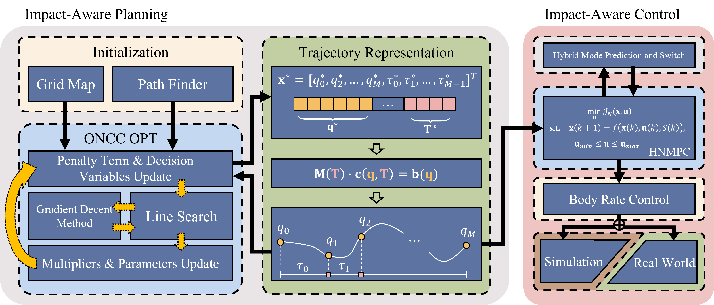

# IMPACTOR
## Update
- We will release our code as soon as possible.
## Introduction

  
  

This repository contains the source code of the impact-aware planning and control algorithms described in our paper "<u>__IMP__</u>act-<u>__A__</u>ware Planning and <u>__C__</u>on<u>__T__</u>rol f<u>__O__</u>r Aerial <u>__R__</u>obots with Suspended Payload."

__Authors__: Haokun Wang1$$\dag$$, Haojia Li1$$\dag$$, [Boyu Zhou](https://boyuzhou.net/)2, [Fei Gao](http://zju-fast.com/fei-gao/)3* and [Shaojie Shen](https://uav.hkust.edu.hk/group/)1

<small>1[HKUST Aerial Robotics Group](https://uav.hkust.edu.hk/), 2 [SYSU STAR Lab](https://boyuzhou.net/), 3 [ZJU FAST Lab](http://zju-fast.com/), .</small>

__Paper__: [arXiv]()

__Supplementary Video__: [YouTube](), [Bilibili]()

__Project Website__: [Homepage](https://sites.google.com/view/suspended-payload/)

_Abstract_: A quadrotor with a cable-suspended payload imposes great challenges in impact-aware planning and control. 
This joint system has dual motion modes, depending on whether the cable is slack or not, presents complicated dynamics. 
Therefore, generating feasible agile flight while preserving the retractable nature of the cable is still a challenging task. 
In this paper, we propose a novel impact-aware planning and control framework that resolves potential impacts caused by motion mode switching. 
Our method leverages the augmented Lagrangian method (ALM) to solve an optimization problem with nonlinear complementarity constraints (ONCC), which ensures trajectory feasibility with high accuracy while maintaining efficiency. 
We further propose a hybrid nonlinear model predictive control method to address the model mismatch issue in agile flight. 
Our methods have been fully validated in both simulation and experiment, demonstrating superior performance compared to existing approaches. 
To the best knowledge of us, we are the first to successfully perform multiple motion mode switching for aerial payload systems in real-world experiments.

